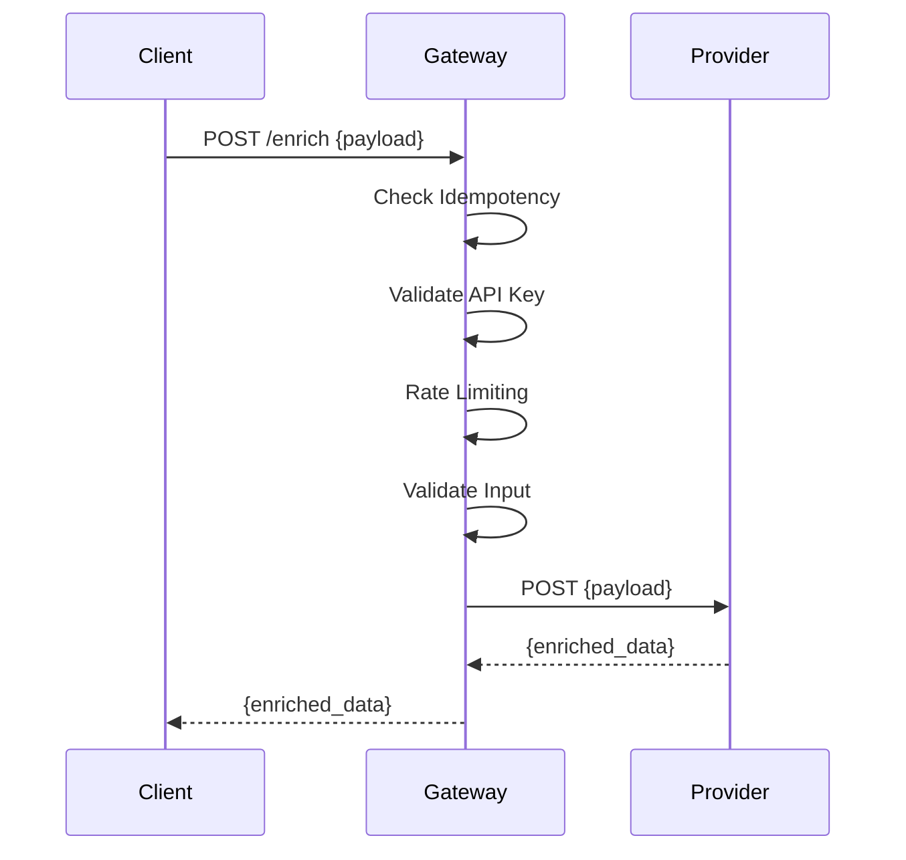

# Mobile Enrichment Gateway

A **Cloudflare Workers** based API Gateway that acts as a single entry point for mobile enrichment requests. It interacts with an upstream provider (e.g., Mock Enrichment Provider) to resolve mobile numbers, confidence scores, and other metadata, demonstrating a real-world API Gateway pattern in a serverless architecture.

---

## Table of Contents

- [Overview](#overview)  
- [Features](#features)  
- [Architecture](#architecture)  
- [Setup & Deployment](#setup--deployment)  
- [API Usage](#api-usage)  
- [Sequence Diagrams](#sequence-diagrams)  
- [Contributing](#contributing)  
- [License](#license)  

---

## Overview

The **Mobile Enrichment Gateway** provides a centralized interface to access mobile enrichment services. It allows:

- Rate limiting per client API key  
- Request validation and input sanitization  
- Upstream provider selection and data enrichment  
- Idempotency handling for repeated requests  

This gateway demonstrates **real-world API Gateway responsibilities**:

- Request routing  
- Authentication and authorization  
- Rate limiting and throttling  
- Error handling and response mapping  
- Logging and monitoring  

The gateway interacts with an upstream microservice, e.g., the **Mock Enrichment Provider**, which can be hosted elsewhere or simulated using Cloudflare Workers.

---

## Features

- **Single Entry Point:** All clients call this gateway instead of backend services directly.  
- **Authentication:** API key-based client validation.  
- **Rate Limiting:** Prevents abuse by limiting requests per client per minute.  
- **Input Validation:** Ensures required fields are present and correctly formatted.  
- **Upstream Integration:** Calls enrichment providers and returns sanitized responses.  
- **Idempotency:** Handles repeated requests gracefully using request IDs.  
- **Cloudflare Worker Serverless Deployment:** Fully serverless and scalable.  

---

## Architecture

### Components

1. **Mobile Enrichment Gateway (this project):** Handles requests from clients and enriches data.  
2. **Mock Enrichment Provider:** Simulates a real third-party service or microservice for testing purposes.  
3. **Client Applications:** Web apps, mobile apps, dashboards, or other services that consume the API.

---

### Sequence Diagram

```mermaid
sequenceDiagram
    participant Client
    participant Gateway
    participant Provider

    Client->>Gateway: POST /enrich {first_name, last_name, address}
    Gateway->>Gateway: Validate API Key
    Gateway->>Gateway: Apply Rate Limiting
    Gateway->>Gateway: Validate Input
    Gateway->>Provider: POST /provider {first_name, last_name, address}
    Provider-->>Gateway: {mobile, confidence, request_id}
    Gateway-->>Client: {mobile, confidence, request_id}
````

---

## Setup & Deployment

### Prerequisites

* Node.js >= 20.x
* NPM or Yarn
* Cloudflare account with Workers enabled

### Install Wrangler (Cloudflare CLI)

```bash
npm install -g wrangler
```

### Project Setup

```bash
git clone https://github.com/yourusername/mobile-enrichment-gateway.git
cd mobile-enrichment-gateway
npm install
```

### Local Development

```bash
npx wrangler dev
```

This starts the gateway locally at `http://127.0.0.1:8787` for testing.

### Deployment

```bash
npx wrangler deploy
```

This will deploy your gateway to your Cloudflare account.

---

## API Usage

### Endpoint

`POST /enrich`

### Request Headers

```http
x-api-key: <your_api_key>
Content-Type: application/json
```

### Request Body

```json
{
  "first_name": "John",
  "last_name": "Doe",
  "address": "123 Street"
}
```

### Response Body

```json
{
  "mobile": "+923001234567",
  "confidence": 0.88,
  "request_id": "uuid-generated",
  "receivedClientData": {
    "first_name": "John",
    "last_name": "Doe",
    "address": "123 Street"
  }
}
```

---

## Sequence Diagram (Detailed Flow)



---

## Contributing

Contributions are welcome!

1. Fork the repository
2. Create a new branch for your feature or bugfix
3. Submit a pull request

---

## License

MIT License

```

This file:  

- Explains **purpose and features**  
- Gives **setup instructions**  
- Shows **sequence diagrams** for client → gateway → provider  
- Details API usage with request and response examples  

---

## 📄 Youtube Tutorial

CodingMavrick:
How to Building an API Gateway (Cloud Native)  on CloudFlare [https://youtu.be/D4Lt18qYkjc]

---
## 👤 Author

Shafqat Altaf
Serverless • Microservices • API Gateway Architectures

